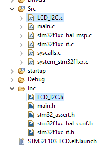
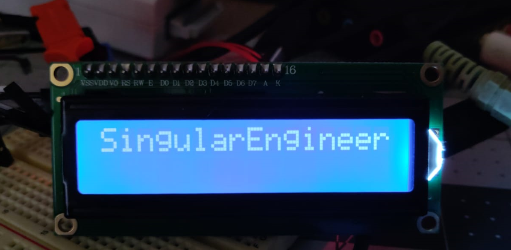

# STM32_LCD
 16x2 I2C LCD library for HD44780 and PCF8574

Please use the data sheet for command reference.

## USAGE
This library is written around code generated by STM32CubeMX/HAL. If you wish to change, there are only a couple of I2C transmit fuctions in LCD_I2C.c that needs to be changed.



```cpp
char *str = "SingularEngineer";

LCD_Init();

//to transmit
while(*str)
	LCD_Data(*str++);
```


